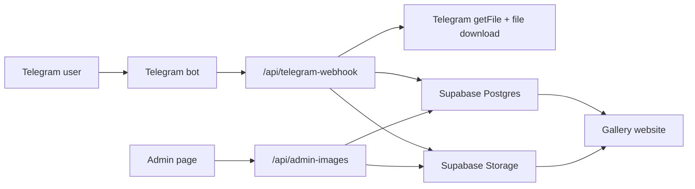

# System Design

## Objective

Build a website that automatically shows new photos when an approved Telegram user sends an image to a Telegram bot.

## Architecture

## Data Flow

1. An approved user sends a photo to the Telegram bot.
2. Telegram sends an update to `/api/telegram-webhook`.
3. The webhook validates `X-Telegram-Bot-Api-Secret-Token`.
4. The webhook checks `ALLOWED_TELEGRAM_USER_IDS`.
5. The webhook selects the largest photo variant.
6. The webhook calls Telegram `getFile`.
7. The webhook downloads the image bytes from Telegram.
8. The webhook uploads the image into Supabase Storage.
9. The webhook inserts a row in `gallery_images`.
10. The website fetches published images from `/api/gallery`.

## Components

### Frontend

- `public/index.html` is the public gallery.
- `public/app.js` polls `/api/gallery` every 15 seconds.
- `public/admin.html` is the admin console.
- `public/admin.js` edits captions, publish status, and deletion.

### Backend API

- `api/telegram-webhook.js` receives Telegram photo updates.
- `api/gallery.js` returns only published images.
- `api/admin-images.js` manages all image records with `ADMIN_TOKEN`.
- `api/public-config.js` exposes public Supabase config if a richer frontend is added later.

### Database

The `gallery_images` table stores image metadata:

- `id`
- `image_url`
- `storage_path`
- `telegram_file_id`
- `caption`
- `sender_id`
- `sender_name`
- `status`
- `created_at`

## Security

- Telegram webhook requests must include `TELEGRAM_SECRET_TOKEN`.
- Optional sender allowlist is controlled by `ALLOWED_TELEGRAM_USER_IDS`.
- Admin actions require `ADMIN_TOKEN`.
- Service role key is used only on the server.
- Public gallery uses anon-safe read access through RLS.

## Build Phases

### Phase 1: MVP

- Telegram webhook
- Supabase upload
- Database insert
- Public gallery display

### Phase 2: Gallery UX

- Responsive masonry layout
- Lightbox preview
- Caption and uploader metadata
- Auto-refresh polling

### Phase 3: Admin

- Token-protected admin page
- Edit captions
- Hide/publish images
- Delete image records and storage objects

### Phase 4: Production

- Deploy to Vercel
- Add custom domain
- Set Telegram webhook
- Monitor failed webhook events
- Consider image compression or CDN transforms for large galleries
